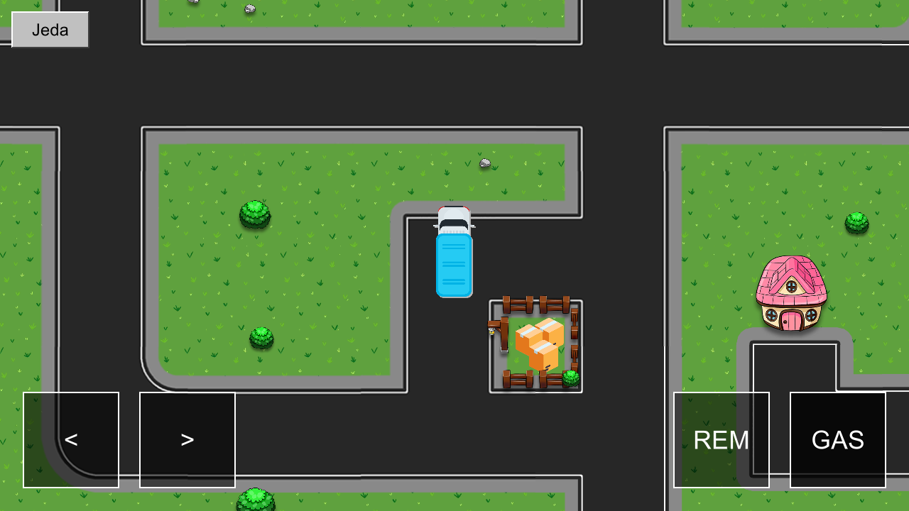
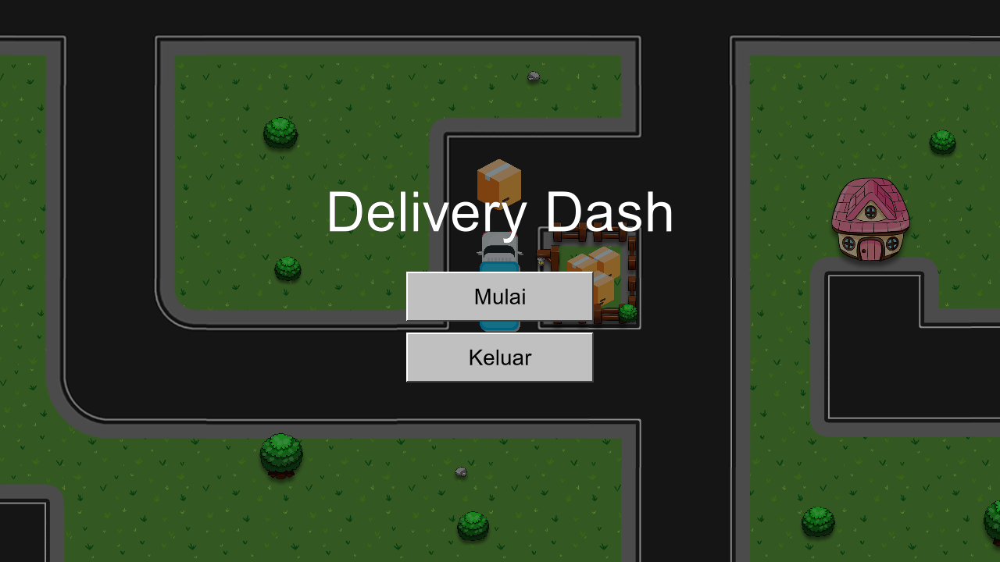
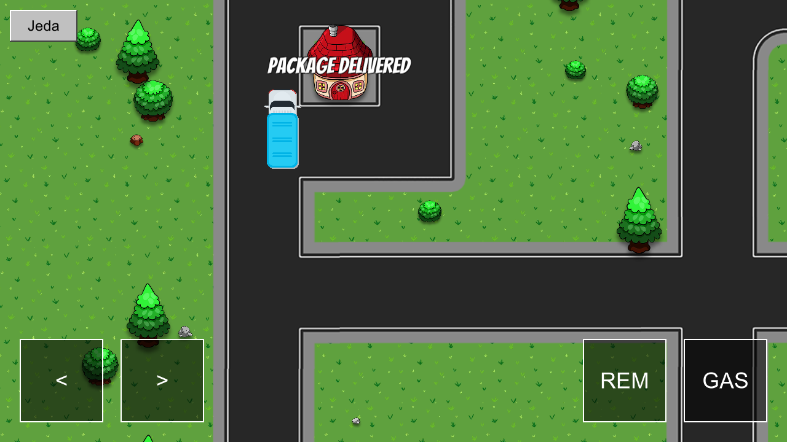

<h1 align="center">Delivery Dash</h1>

<p align="center">
  Game antar paket 2D untuk Android. Ambil paket di tempat paket, lalu antarkan ke rumah pelanggan.
</p>

<p align="center">
  <a href="https://github.com/Nijika21/delivery-dash/releases/latest/download/DeliveryDash.apk">
    
  </a>
</p>

<p align="center">
  <a href="https://github.com/Nijika21/delivery-dash/releases/latest">Halaman rilis terbaru</a>
</p>

<p align="center">
  
</p>

## Tentang

Delivery Dash adalah game mengemudi sederhana dengan tampilan dari atas. Pemain mengendalikan truk pengantar di sebuah lingkungan perumahan, mengambil paket di tempat paket, lalu mengantarkannya ke salah satu dari lima rumah. Setelah paket diterima, paket baru muncul kembali di tempat paket sehingga permainan dapat berlanjut tanpa batas.

Game ini dapat dimainkan tanpa internet dan tidak memuat iklan maupun pembelian dalam aplikasi. Kode game tidak mengirim data apa pun; izin internet di daftar izin aplikasi ditambahkan otomatis oleh Unity.

## Tangkapan layar

| Lobby | Bermain | Paket sampai |
|:---:|:---:|:---:|
|  |  |  |

## Cara bermain

1. Tekan **Mulai** di lobby. Permainan dijalankan dalam orientasi mendatar (landscape).
2. Kendarai truk ke **tempat paket** untuk mengambil paket.
3. Antarkan paket ke **rumah mana saja**. Tulisan *Package Delivered* muncul di atas rumah yang menerima paket.
4. Paket baru muncul kembali di tempat paket. Ulangi sesuka hati.

Tombol **Jeda** di kiri atas mengembalikan pemain ke lobby. Tombol **Keluar** di lobby menutup aplikasi.

### Kontrol

| Aksi | Layar sentuh | Keyboard |
|---|---|---|
| Maju | `GAS` | `W` / `↑` |
| Mundur | `REM` | `S` / `↓` |
| Belok kiri | `<` | `A` / `←` |
| Belok kanan | `>` | `D` / `→` |
| Jeda / kembali | `Jeda`, tombol Kembali Android | `Esc` |

## Persyaratan

- Android 6.0 (API 23) atau lebih baru, arsitektur ARMv7 atau ARM64.
- Untuk memasang APK di luar Play Store, izinkan pemasangan dari sumber tidak dikenal pada aplikasi yang digunakan untuk membuka berkas APK.

## Membangun dari kode sumber

> **Catatan aset.** Gambar truk, paket, jalan, rumah, dan dekorasi berasal dari aset tutorial pihak ketiga yang lisensinya tidak dapat dipastikan, sehingga folder `Assets/env1/` dan ikon aplikasi (`Assets/Art/AppIcon/`) tidak disertakan di repositori ini. Scene tetap dapat dibuka, tetapi sprite-nya tampil kosong dan build APK memerlukan gambar pengganti dengan nama yang sama. APK di halaman rilis sudah berisi semua gambar.

Kebutuhan:

- Unity **6000.2.12f1** dengan modul **Android Build Support** (termasuk OpenJDK dan Android SDK/NDK).

Langkah:

1. Klon repositori ini, lalu buka foldernya melalui Unity Hub.
2. Buka scene `Assets/Game/DeliveryDash.unity` untuk mencoba di editor.
3. Untuk membangun APK, pilih menu **Delivery Dash → Build APK Android**. Hasilnya tersimpan di `Builds/Android/DeliveryDash.apk`.

Pembangunan juga dapat dijalankan dari baris perintah:

```bash
Unity -batchmode -quit -projectPath . -buildTarget Android -executeMethod DeliveryDash.Editor.AndroidBuild.BuildAndroid
```

Pengujian otomatis alur ambil dan antar paket:

```bash
Unity -batchmode -projectPath . -executeMethod DeliveryDash.Editor.Tests.LoopChecks.RunBatch
```

Hasil pengujian ditulis ke `Logs/loop-checks.txt`.

## Struktur proyek

| Lokasi | Isi |
|---|---|
| `Assets/Game/DeliveryDash.unity` | Scene utama |
| `Assets/Game/DeliveryLauncher.cs` | Lobby, tombol jeda, dan kendali sentuh |
| `Assets/Game/DeliveryDriver.cs` | Gerak truk dari keyboard dan kendali sentuh |
| `Assets/Game/DeliveryCollision.cs` | Ambil dan antar paket, tulisan *Package Delivered* |
| `Assets/Editor/AndroidBuild.cs` | Skrip pembangunan APK |
| `Assets/Editor/Tests/LoopChecks.cs` | Pengujian alur permainan |

## Kredit

- Font Bangers oleh The Bangers Project Authors, lisensi SIL Open Font License 1.1 (`Assets/Game/OFL-Bangers.txt`).
- Sprite jalan, rumah, truk, paket, dan dekorasi di APK berasal dari aset tutorial pihak ketiga (tidak disertakan di repositori ini).
- Dibuat dengan Unity dan Universal Render Pipeline.
